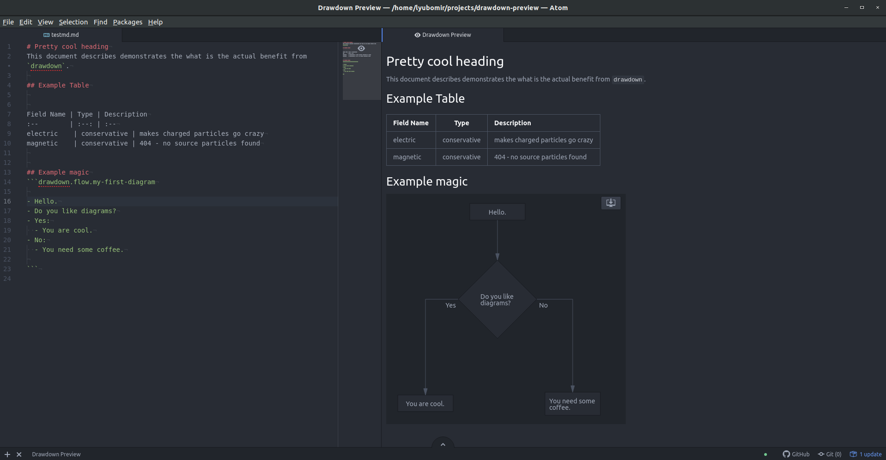
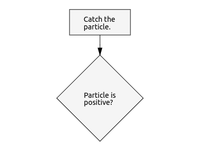
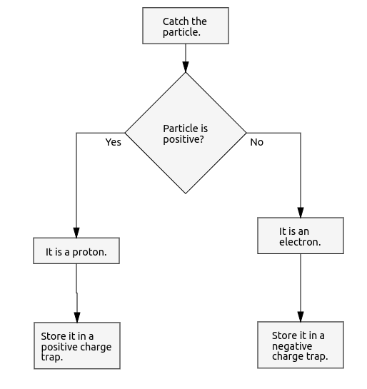
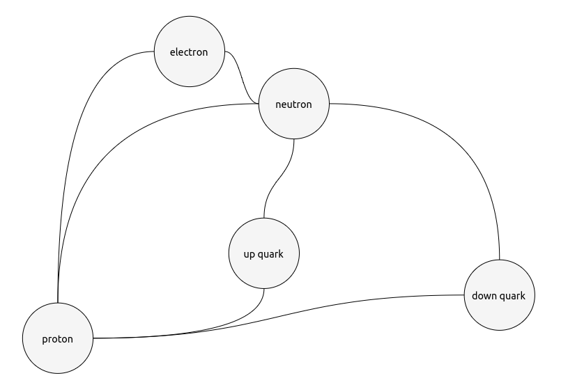
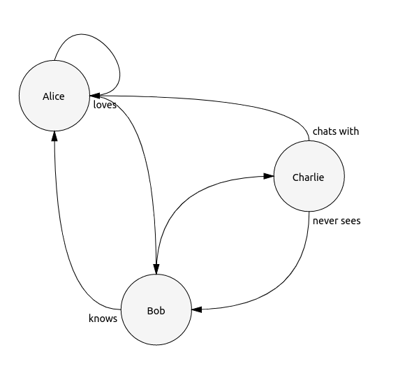

# Drawdown preview package

Atom plugin for visualizing markdown files with `drawdown` diagrams in it.



Plugin relies on the [drawdown parser][b7941411] and [drawdown renderer][4619e374] which are build especially for the purposes of this plugin, but already live their own live as `npm` modules.


  [b7941411]: https://github.com/lyubo-slavilov/drawdown-parser "npm install drawdown-parser"
  [4619e374]: https://github.com/lyubo-slavilov/drawdown-svg-render "npm install drawdown-svg-render"

## Drawdown syntaxis

The syntax of the drawdown language is preatty simple with main goal to be as human readable as possible.

### Header
All drawdon diagrams are parsed form markdown `code block` and need to hav header in the format `drawdown.<diagram-type>.<diagram-identifier`

Example
    ```drawdown.flow.particle-trap
      ...
      ...

    ```

In the example above we will have a flow diagram called `particle-trap`.

### Flow diagrams
Currently flow diagrams consist of two different type of blocks you can use:

#### Process block
To add process block just type
```
- Catch the particle.
```

#### Conditional block
To add conditional block just type
```
- Particle is positive?
```

You will notice all blocks starts with `-` token and ends either with full stop `.` or question mark `?` followed by new line.

Example

    ```drawdown.flow.particle-trap

    - Catch the particle.
    - Particle is positive?

    ```
This will prodice the following diagram:



#### Branching the flow
In order to branch several flow paths (e.g. arrows) from a block all you have to use the `condition` label

```
- Yes:
```
After that indent the blocks in the branch

Example

    ```drawdown.flow.particle-trap

    - Catch the particle.
    - Particle is positive?
    - Yes:
      - It is a proton.
      - Store it in a positive charge trap.
    - No:
      - It is an electron.
      - Store it in a negative charge trap.

    ```


There are several things to emphasis:
1. The actual indentation size is not important until it is consistent over the branch
2. Tokens of type `condition` can have any label you want: `- Yes:`, `- No:`, `- Negative:`, `- Positive:`, etc
3. You can branch as many branches as you want, but arrows will start look awkward.

### Graph diagrams

This diagrams represent general graphs and their syntax is ridiculously simple:

    ```drawdown.graph.entanglement

    electron ~~ proton
    proton ~~ neutron
    electron ~~ neutron
    up quark ~~ proton
    down quark ~~ proton
    up quark ~~ neutron
    down quark ~~ neutron
    ```
This will produce something like



#### Arrows

You can have several types of arrows

Arrow  | Source Head | Target Head |     Line type
:-----:|:-----------:|:-----------:|:----------------:
 `--`  |     no      |     no      | Straight poly-line
`-->`  |     no      |     yes     | Straight poly-line
`<--`  |     yes     |     no      | Straight poly-line
`<-->` |     yes     |     yes     | Straight poly-line
 `~~`  |     no      |     no      | Curved line
`~~>`  |     no      |     yes     | Curved line
`<~~`  |     yes     |     no      | Curved line
`<~~>` |     yes     |     yes     | Curved line

You can have arrow labels by placing a text between the arrow's token style symbols:

    ```drawdown.graph.entanglement
    Alice ~~ Alice
    Alice ~loves~> Bob
    Bob ~knows~> Alice
    Bob ~~> Charlie
    Charlie ~never sees~> Bob
    Charlie ~chats with~> Alice
    ```


