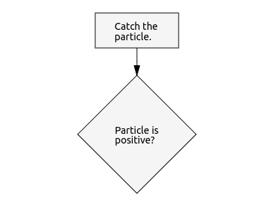
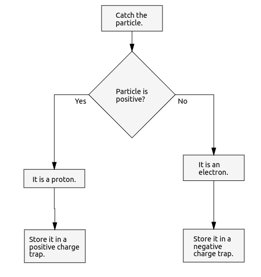
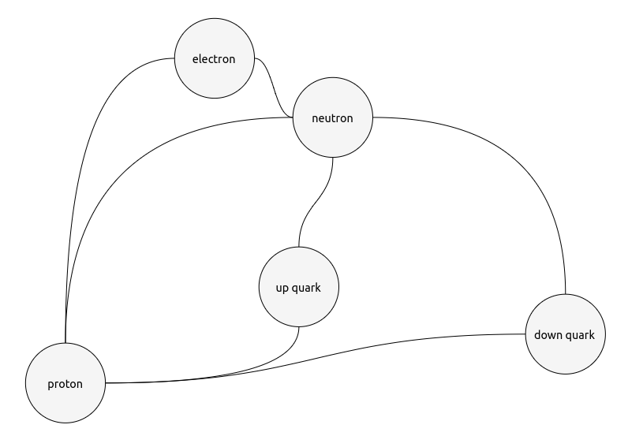
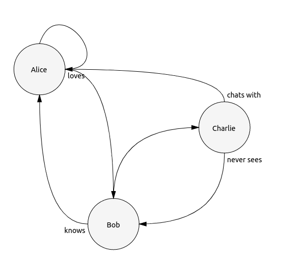

# Drawdown preview package

Atom plugin for visualizing markdown files with `drawdown` diagrams in it.


Plugin relies on the [drawdown parser][b7941411] and [drawdown renderer][4619e374] which are build especially for the purposes of this plugin, but already live their own live as `npm` modules.


  [b7941411]: https://github.com/lyubo-slavilov/drawdown-parser "npm install drawdown-parser"
  [4619e374]: https://github.com/lyubo-slavilov/drawdown-svg-render "npm install drawdown-svg-render"

## Drawdown syntaxis

The syntax of the drawdown language is pretty simple and its main goal is to be as human readable as possible.

### Header
All drawdon diagrams are parsed form markdown `code block` and need to have a header in the format `drawdown.<diagram-type>.<diagram-identifier`

Example

    ```drawdown.flow.particle-trap
      ...
      ...

    ```

In the example above we declared **flow** diagram called `particle-trap`.

### Flow diagrams
Currently flow diagrams consist of two different type of blocks you can use:

#### Process block

Process blocks are represented by a simple rectangular shape and we can declare them by typing:

```
- Catch the particle.
```

#### Conditional block
Conditional blocks are represented by a diamond shape and we can declare them by typing:

```
- Particle is positive?
```

You will notice all blocks start with `-` token and end either with full stop `.` or question mark `?` followed by new line.

Example

    ```drawdown.flow.particle-trap

    - Catch the particle.
    - Particle is positive?

    ```
This will prodice the following diagram:



#### Arrow labeling
We can label an arrow by using a special token called `CASE` token. Its syntax is as follows `- <label>:`

Example

```
- Yes:
```

#### Branching the flow

In order to branch several flow paths (arrows) from a block all we have to do is to use an arrow label (a CASE token) and indentation for the consequential blocks:

```
- Yes:
  - Branched block.
- No:
  - Another Branched block.
- Maybe:
  - Third branch.
  - The third branch follows.
```

Example

    ```drawdown.flow.particle-trap

    - Catch the particle.
    - Particle is positive?
    - Yes:
      - It is a proton.
      - Store it in a positive charge trap.
    - No:
      - It is an electron.
      - Store it in a negative charge trap.

    ```


There are several things we should know:
1. The actual indentation size is not important as long as it is consistent over the branch.
2. Tokens of type `CASE` can have any label we want: `- Yes:`, `- No:`, `- Negative:`, `- Positive:`, etc.
3. We can branch as many branches as we want, but arrows will start to look awkward.

### Graph diagrams

This diagrams represent general graphs and their syntax is ridiculously simple:

    ```drawdown.graph.entanglement

    electron ~~ proton
    proton ~~ neutron
    electron ~~ neutron
    up quark ~~ proton
    down quark ~~ proton
    up quark ~~ neutron
    down quark ~~ neutron
    ```
This will produce something like



#### Arrows

We have several types of arrows which we can use

Arrow  | Source Head | Target Head |     Line type
:-----:|:-----------:|:-----------:|:----------------:
 `--`  |     no      |     no      | Straight poly-line
`-->`  |     no      |     yes     | Straight poly-line
`<--`  |     yes     |     no      | Straight poly-line
`<-->` |     yes     |     yes     | Straight poly-line
 `~~`  |     no      |     no      | Curved line
`~~>`  |     no      |     yes     | Curved line
`<~~`  |     yes     |     no      | Curved line
`<~~>` |     yes     |     yes     | Curved line

We can have arrow labels by placing a text between the arrow's token style symbols:

    ```drawdown.graph.quantum-teleportation
    Alice ~~ Alice
    Alice ~loves~> Bob
    Bob ~knows~> Alice
    Bob ~~> Charlie
    Charlie ~never sees~> Bob
    Charlie ~chats with~> Alice
    ```


